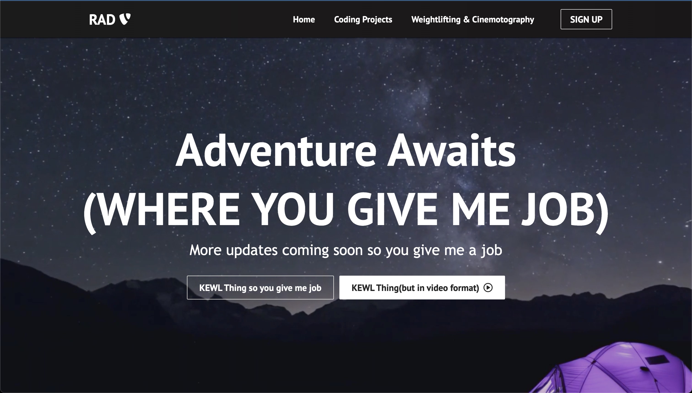

# Rad's Website

Building my own website to showcase my projects, hobbies, more information about me and contact me. 

This is still a work in progress as I am still building it. ***More Changes Coming Soon***

## What the website looks like now - To Be Updated

---

### Hobbies Page

---

### Contact Me Page

## Available Scripts

### `npm start`

Runs the app in the development mode.\
Open [http://localhost:3000](http://localhost:3000) to view it in your browser.

The page will reload when you make changes.\
You may also see any lint errors in the console.

### `npm test`

Launches the test runner in the interactive watch mode.\
See the section about [running tests](https://facebook.github.io/create-react-app/docs/running-tests) for more information.
